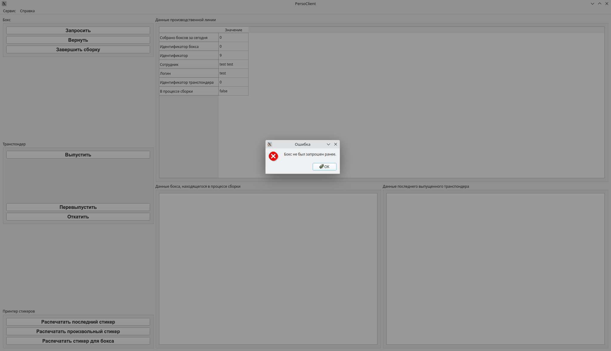

# Инструкция по использованию клиента персонализации

## Рабочий процесс
1. Запустите PersoClient. Появится такое окно:

2. Введите свои учётные данные и нажмите кнопку "Войти":

После входа появится следующее окно:

3. Нажмите кнопку "Запросить" в левой верхней части окна, чтобы получить данные
бокса для сборки. Эти данные будут показаны в панели внизу:

\pagebreak

4. Чтобы выпустить транспондер, подключите новую плату к программатору и
нажмите кнопку "Выпустить" в левой средней части окна. После выпуска
трансподера его данные будут отображены в правой нижней панели:

Обратите внимание: изменилось количество выпущенных транспондеров в панели
данных бокса внизу.

5. Продолжайте выпускать транспондеры, пока не будут выпущены все транспондеры
   в боксе. После этого нажмите кнопку "Завершить сборку", чтобы распечатать
стикер для бокса и стикер для паллеты, если выпущенный бокс оказался последним
в паллете.

6. Вернитесь к шагу 3.

\pagebreak

## Справочник по непредвиденным ситуациям:

1. "Ошибка: все транспондеры в боксе собраны."

Необходимо завершить сборку бокса нажатием на кнопку "Завершить сборку" в левой
верхней части экрана.

2. "Ошибка: сборка текущего заказа завершена."

Эта ошибка означает, что больше нет доступных боксов для сборки. Ожидайте
дальнейших инструкций.

3. "Ошибка: бокс не был запрошен ранее." или "Ошибка: Производственная линия не
находится в процессе сборки. Необходимо запросить бокс."

Необходимо запросить бокс нажатием на кнопку "Запросить" в верхней левой части
экрана.

\pagebreak

4. "Ошибка: Производство не запущено"

Ваша производственная линия не активна. Обратитесь к Султану.

5. "Ошибка: В боксе собраны не все транспондеры."

Вы попытались завершить бокс, не собрав все транспондеры в нём. Продолжайте
выпускать транспондеры в соответствии с инструкцией. Проверить количество
собранных транспондеров можно в панели "Данные бокса, находящегося в процессе
сборки".

\pagebreak

6. "Ошибка: Получена ошибка программатора"

Попробуйте поменять плату. Если ошибка появится опять, обратитесь к
Султану.

7. "Ошибка: Данная печатная плата уже была использована при сборке. Используйте
другую плату."

Поменяйте плату.
